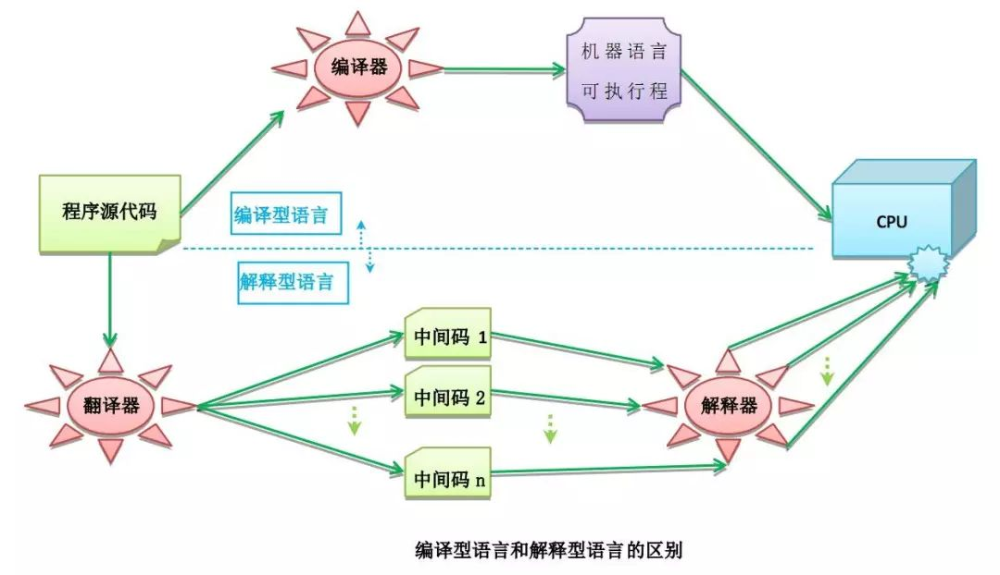
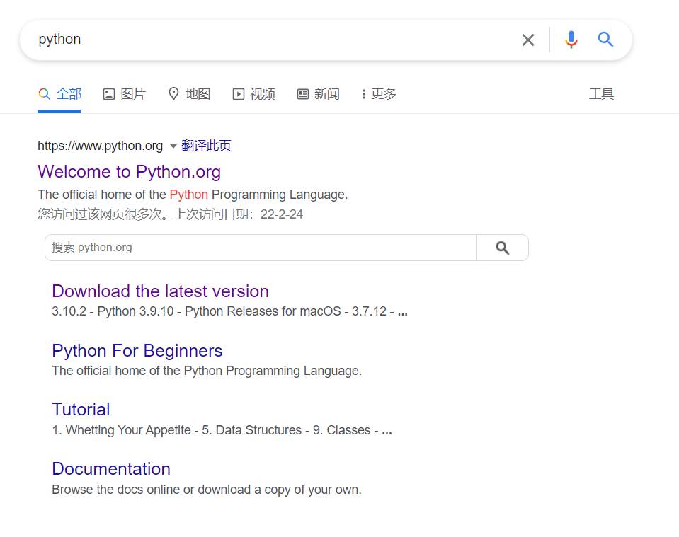
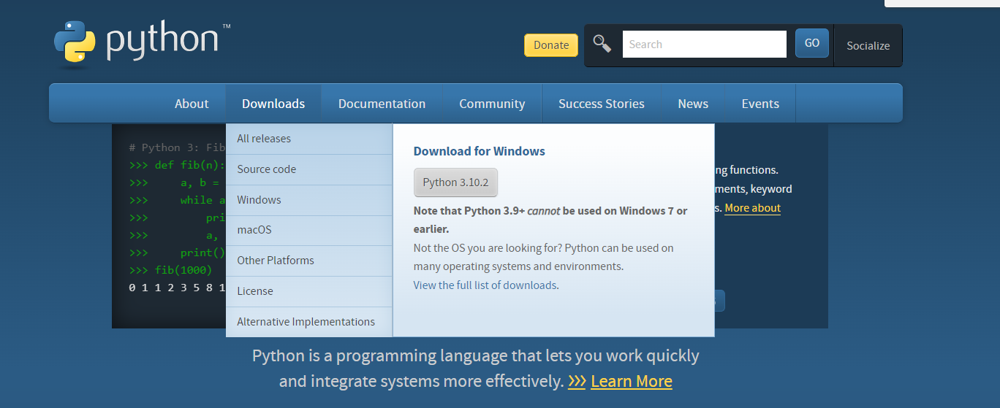
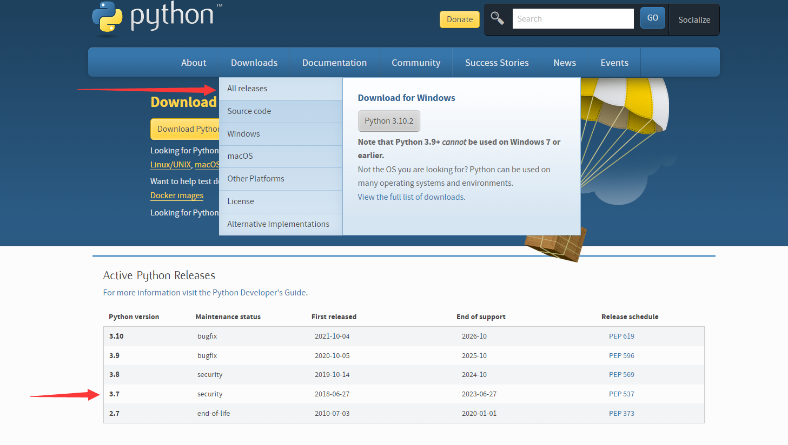
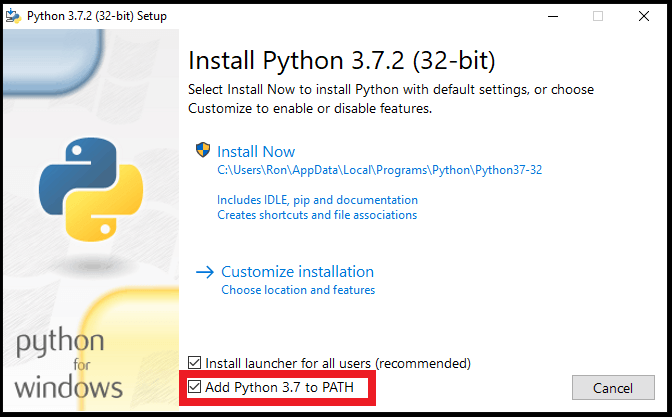
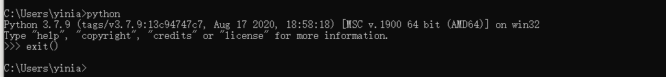
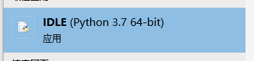
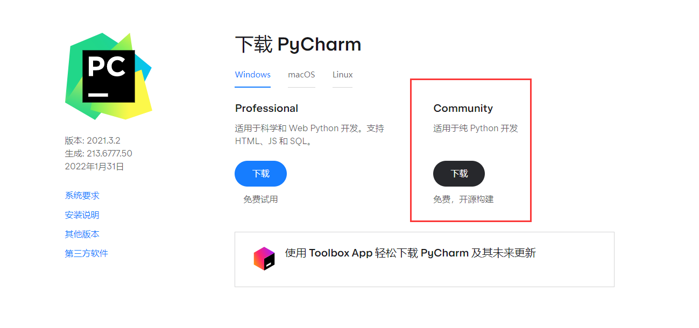
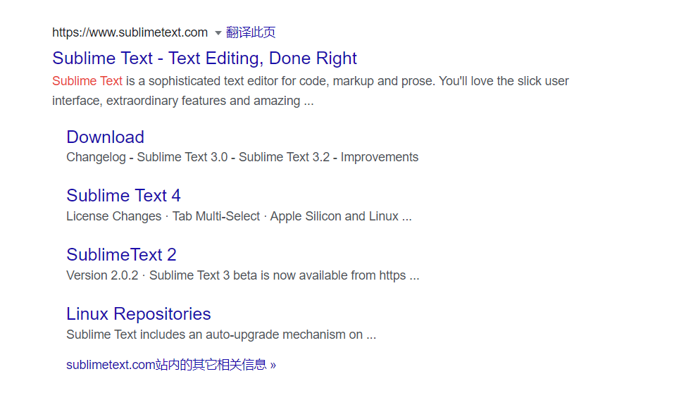
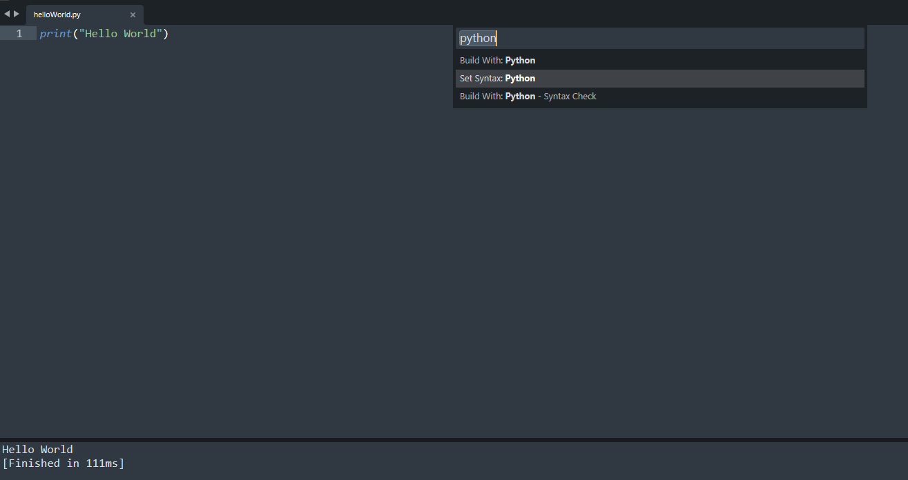

# Python Lesson01：准备工作与工具

Python语言是一种广泛使用的解释型、高级和通用的编程语言。Python支持多种编程范型，包括函数式、指令式、反射式、结构化和面向对象编程。

Python拥有动态类型系统和垃圾回收功能，能够自动管理内存使用，并且其本身拥有一个巨大而广泛的标准库。它的语言结构以及面向对象的方法旨在帮助程序员为小型的和大型的项目编写清晰的、合乎逻辑的代码。

Python解释器本身几乎可以在所有的操作系统中运行。Python的官方解释器CPython是用C语言编写的，它是一个由社群驱动的自由软件，目前由Python软件基金会管理。

Python是解释性的语言：



Python语言的运行效率并不能够比得上C或者C++，但是使用Python语言进行开发的效率来的更高。

首先我们需要安装Python语言：



打开这个网站之后可以发现：



虽然Python 3.10.2是现阶段的最新的Python版本，但是这里并不推荐使用最新版本的Python语言，因为部分库能够并不支持最新版本的Python。

我们这是使用的是Python 3.7版本，这个是比较主流的版本，也适用于多数的使用或者支持Python的库或者软件：



需要注意的地方在于，当我们安装Python语言的时候，我们需要勾选add to PATH的选项：



这样一来Python语言便被加入到了开发环境当中。

当我们安装完成之后，我们可以打开cmd指令开测试是否成功的安装和将Python加载到PATH中：


如上图所示，我们成功的安装了Python语言，并且进入到了Python开发环境当中。

我们可以输入exit()来退出Python开发环境：



安装Python语言的时候，自带了一款Python语言的编译器：



但是这里并不推荐使用Python语言自带的编译器，而是使用第三方的编译器：Pycharm。


Pycharm有两个版本，这里推荐的是社区版本而不是专业版本：



社区版本是免费且开源的，对于新手而言已经足够使用了。

除了Pycharm之外，推荐使用的编辑器是sublime text：



如果你想要使用sublime text来运行Python代码，可以使用ctrl+shift+P然后选择Python语言，接着在完成Python代码之后使用Ctrl+B来运行Python代码。

如下图所示：



另外推荐使用的是jupyter notebook，这是一款轻量的编译器，通常在数据分析或者数据科学相关领域被使用到，如果有需求可以自行下载。

Python语言所持有的禅可以使用import this来进行调查：

```python
import this
```


输出的结果为：

```python
The Zen of Python, by Tim Peters

Beautiful is better than ugly.
Explicit is better than implicit.
Simple is better than complex.
Complex is better than complicated.
Flat is better than nested.
Sparse is better than dense.
Readability counts.
Special cases aren't special enough to break the rules.
Although practicality beats purity.
Errors should never pass silently.
Unless explicitly silenced.
In the face of ambiguity, refuse the temptation to guess.
There should be one-- and preferably only one --obvious way to do it.
Although that way may not be obvious at first unless you're Dutch.
Now is better than never.
Although never is often better than *right* now.
If the implementation is hard to explain, it's a bad idea.
If the implementation is easy to explain, it may be a good idea.
Namespaces are one honking great idea -- let's do more of those!
```


