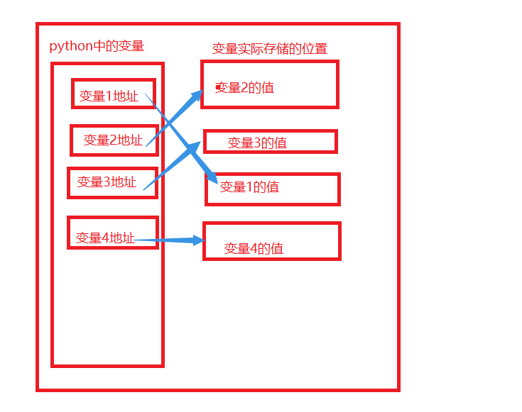

# Python Lesson02：打印与变量

## 打印

我们打开sublime text，将语言选择为Python语言，接着输入：

```python
print("Hello World")
```


按住ctrl+s进行保存，然后按住ctrl+B来进行运行：


运行的结果为Hello World。在这一段代码中print()是一个函数，用来将括号中的内容打印出来，而”Hello World“则表明了文本内容为Hello World。

接着我们使用一个变量来指代Hello World，并且将这个变量打印出来：

```python
sayHello = "Hello World"

print(sayHello)
```


运行的结果为：

```python
Hello World
```


在这一段代码中sayHello = "Hello World"表示我们将文本”Hello World“赋值到了sayHello这个变量中，之后当我们使用sayHello的时候，便会将其与Hello World这个文本相互关联。

print()函数不仅仅可以打印文本，也可以打印数字或者打印数字计算的结果：

```python
print(15)

print(10+15)

a = 15
b = 20

print(a+b)
```


运行的结果为：

```python
15
25
35
```


print()函数中的内容并不一定需要在同一行：

```python
print("Hello World "
  "GoodBye World")
```


运行的结果为：

```python
Hello World GoodBye World
```


## 变量

我们接着来了解一下什么是变量：变量来源于数学，是计算机语言中能储存计算结果或能表示值的抽象概念。

在我们上部分的代码中，无论是sayHello还是a或者b，实际上都是变量。



假设我们申明了一个变量并且对其进行赋值，那么该变量将会有该值的内存存储地址，当我们使用这个变量的时候，我们便会调用对应内存地址中的值。

比如说：

```python
a = 10
```


那么，计算机首先会在内存上开辟一个内存空间，接着将10这个值存储到这个内存空间中，接着申明一个变量a，并且让变量a存储该值的地址。

如果我们对a进行重新赋值：

```python
a = 10
a = 20
```


我们实际上是开辟了一个新的内存空间，并且向该内存空间存储20这个值，接着将新开辟的内存空间的内存地址赋值给a这个变量，如此a便指向了新的值。

Python语言允许进行同时赋值：

```python
a = b = c = 10
```


如此，a，b，c三个变量所对应的值都是10。

我们可以使用id()函数来查看一个变量的内存地址：

```python
a = b = c = 1

print(id(a))
print(id(b))
print(id(c))
```


运行的结果为：

```python
140723550059584
140723550059584
140723550059584
```


可以发现，实际上a,b,c三个变量都指向了同一个内存地址。

或者我们可以这么做：

```python
a, b = 1, 2

print(a)
print(b)

print(id(a))
print(id(b))
```


运行的结果为：

```python
1
2
140723819412544
140723819412576
```


可以发现，我们分别给a和b赋值了1和2。

在Python语言中，有6个标准的数据类型：

1. Number（数字）
2. String（字符串）
3. List（列表）
4. Tuple（元组）
5. Set（集合）
6. Dictionary（字典）

Python3 的六个标准数据类型中：

- 不可变数据（3 个）：Number（数字）、String（字符串）、Tuple（元组）；
- 可变数据（3 个）：List（列表）、Dictionary（字典）、Set（集合）。

如果我们不知道我们所使用的变量是什么类型的变量，我们可以使用type()函数来查看：

```python
numberOne = "123321"
numberTwo = 123321

print(type(numberOne))
print(type(numberTwo))
```


运行的结果为：

```python
<class 'str'>
<class 'int'>
```


Python语言中的命名规则为：

1. 标识符可以由字母、数字、下画线（_）组成，其中数字不能打头。
2. 标识符不能是 Python 关键字，但可以包含关键字。
3. 标识符不能包含空格。

如果你不知道Python的关键字是什么，可以使用：

```python
import keyword   # 导入了关键字模块

print(keyword.kwlist)   # 打印keyword的列表
```


运行的结果为：

```python
['False', 'None', 'True', 'and', 'as', 'assert', 'async', 'await', 'break', 'class', 'continue', 'def', 'del', 'elif', 'else', 'except', 'finally', 'for', 'from', 'global', 'if', 'import', 'in', 'is', 'lambda', 'nonlocal', 'not', 'or', 'pass', 'raise', 'return', 'try', 'while', 'with', 'yield']
```


Python 3是支持中文的，所以我们可以：

```python
打招呼 = "你好"

print(打招呼)
```


运行的结果为：

```python
你好
```


但是我们推荐使用英文作为变量名，而不是使用中文或者其他的什么语言。

