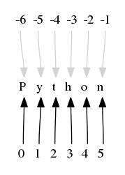

# Python Lesson03：整型，浮点型和字符串类型

## 整型

整型(int) - 通常被称为是整型或整数，是正或负整数，不带小数点。Python3 整型是没有限制大的，可以当作 Long 类型使用，所以 Python3 没有 Python2 的 Long 类型。

如下所示为整型的常用用法：

```python
print(10)
print(10+10)

a = 10
print(a)
a = 20
print(a)

a = 10
b = 20
print(a,b)
print(a+b)
```


运行的结果为：

```python
10
20
10
20
10 20
30
```


实际上整数型没有什么特别需要讨论的。

需要注意的是，在Python语言中，整数的大小只取决于内存大小的限制，在内存大小充足的情况之下，整型的长度可以是无限的：

```python
a = 21321635465464544654654654613249683486431265413851321
b = 56464654346875968798797897943165413245643243212545456464646

print(a+b)
```


运行的结果为：

```python
56464675668511434263342552597820026495326729643810870315967
```


Python的int类型的数字可以比C或者C++中的long long要大很多。

## 浮点型

浮点型由整数部分与小数部分组成：

```python
a = 12.02

print(a)
```


运行的结果为：

```python
12.02
```


或者我们也可以使用科学计数法来进行表示：

```python
a = 2.5e2
b = 2.5e-3

print(a)
print(b)
```


运行的结果为：

```python
250.0
0.0025
```


## 数字类型之间的转换

我们可以使用int()和float()两个函数来对数字的类型进行转换：

```python
a = 10.00

print(a)
print(int(a))
print(type(int(a)))
```


运行的结果为：

```python
10.0
10
<class 'int'>
```


和：

```python
a = 10

print(a)
print(float(a))
print(type(float(a)))
```


运行的结果为：

```python
10
10.0
<class 'float'>
```


## 字符串类型

字符串是 Python 中最常用的数据类型。我们可以使用引号( **'** 或 **"** )来创建字符串：

```python
string_One = "string variable"
print(type(string_One))
print(string_One)
```


运行的结果为：

```python
<class 'str'>
string variable
```


我们可以通过索引位置来访问字符串的中的对应位置的字符：

```python
programming_Language = "Python"

print(programming_Language[0])
print(programming_Language[1])

print(programming_Language[-1])
print(programming_Language[-2])
```


运行的结果为：

```python
P
y
n
o
```


具体的逻辑如下所示：



需要注意的地方在于，在Python语言中，初始位置是0而不是1。

我们也可以使用切片的方式来访问一连串的位置的字符：

```python
programming_Language = "Python"

print(programming_Language[0:2])
```


运行的结果为：

```python
Py
```


课件我们打印了0,1两个位置的字符，也就是说切片遵循的是左闭右开的原则，即包含左边的位置但是不包含右边的位置的字符。

字符串常见的操作如下所示;

下表实例变量 a 值为字符串 "Hello"，b 变量值为 "Python"：

|操作符|描述|实例|
|---|---|---|
|+|字符串连接|a + b 输出结果： HelloPython|
|*|重复输出字符串|a*2 输出结果：HelloHello|
|[]|通过索引获取字符串中字符|a[1] 输出结果 e|
|[ : ]|截取字符串中的一部分，遵循左闭右开原则，str[0:2] 是不包含第 3 个字符的。|a[1:4] 输出结果 ell|
|in|成员运算符 - 如果字符串中包含给定的字符返回 True|'H' in a 输出结果 True|
|not in|成员运算符 - 如果字符串中不包含给定的字符返回 True|'M' not in a 输出结果 True|
|r/R|原始字符串 - 原始字符串：所有的字符串都是直接按照字面的意思来使用，没有转义特殊或不能打印的字符。 原始字符串除在字符串的第一个引号前加上字母 r（可以大小写）以外，与普通字符串有着几乎完全相同的语法。|print( r'\n' )|
|print( R'\n' )|||


Python语言内置了许多与字符串相关的函数。

upper()函数可以将所有的小写字符转换为大写字符：

```python
programming_Language = "Python"

print(programming_Language.upper())
```


运行的结果为：

```python
PYTHON
```


同样的我们也可以将所有的字符从大写字符转换为小写字符，通过使用lower()函数：

```python
programming_Language = "PYTHON"

print(programming_Language.lower())
```


运行的结果为：

```python
python
```


亦或者我们可以将所有单词的首字母以大写的形式来进行显示：

```python
programming_Language = "python language"

print(programming_Language.title())
```


运行的结果为：

```python
Python Language
```


或者我们可以求取字符串的长度：

```python
programming_Language = "python language"

print(len(programming_Language))
```


运行的结果为：

```python
15
```


如果我们需要判断字符串是否只包含数字，则可以使用isdigit()函数：

```python
is_number = "123654"

print(is_number.isdigit())
```


运行的结果为：

```python
True
```


此外还有很多其他的内置的函数，可以在需要使用的时候再查询。

