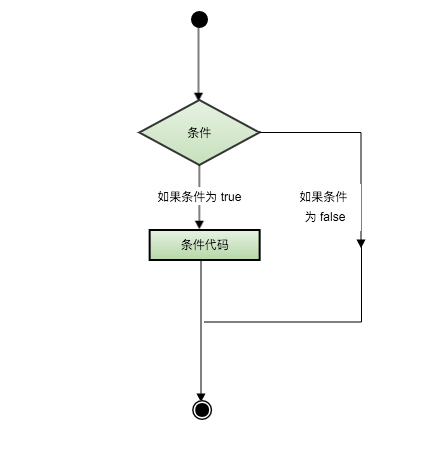

# Python Lesson05：条件运算符

Python语言的条件判断语句可以被如下所示的结构图所展示：



我们先来实现一个双项判断的if语句：

```python
grade = int(input("请输入学生的成绩："))

if grade>=60:
  print("成绩及格")
else:
  print("成绩不及格")
```


在这里，成绩以60作为了界限，如果大于60则属于及格，如果小于60则是不及格。

但是我们可以更加的细分：

```python
grade = int(input("请输入学生的成绩："))

if grade<60:
  print("不及格")
elif grade>=60 and grade<70:
  print("良好")
elif grade>=70 and grade<80:
  print("优秀")
else:
  print("突出")
```


我们可以将大于等于60的成绩进行细分。

或者我们来实现一下if的嵌套语句：

```python
proof = int(input("输入驾驶员每 100ml 血液酒精的含量："))
if proof < 20:
    print("驾驶员不构成酒驾")
else:
    if proof < 80:
        print("驾驶员已构成酒驾")
    else:
        print("驾驶员已构成醉驾")
```


