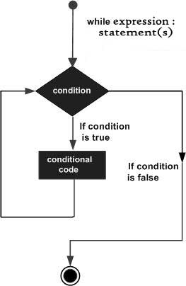
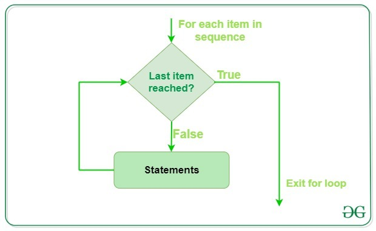

# Python Lesson06：循环语句

## While循环

Python 编程中 while 语句用于循环执行程序，即在某条件下，循环执行某段程序，以处理需要重复处理的相同任务。



循环语句的结构如上所示。

我们可以来尝试一个简单的代码：

```python
count = 0
while (count < 9):
   print 'The count is:', count
   count = count + 1
 
print "Good bye!"
```


运行的结果为：

```python
The count is: 0
The count is: 1
The count is: 2
The count is: 3
The count is: 4
The count is: 5
The count is: 6
The count is: 7
The count is: 8
Good bye!
```


while循环还有两个非常重要的关键字：continue和break。

continue 用于跳过该次循环：

```python
i = 1
while i < 10:   
    i += 1
    if i%2 > 0:     # 非双数时跳过输出
        continue
    print(i)         # 输出双数2、4、6、8、10
```


运行的结果为：

```python
2
4
6
8
10
```


break 来跳过循环：

```python
i = 1
while 1:            # 循环条件为1必定成立
    print i         # 输出1~10
    i += 1
    if i > 10:     # 当i大于10时跳出循环
        break
```


运行的结果为：

```python
1
2
3
4
5
6
7
8
9
10
```


需要注意的是，1和true是等同的：

```python
if (1 == True):
  print("1 = True")
```


运行结果为：

```python
1 = True
```


所以上面的while循环其实判断的条件是恒定为True的，只是达成了某一个条件之后使用break来跳出了while循环。

基于这一点，其实我们可以实现让用户实现是否退出循环的功能：

```python
print("你可以输入任何一个数字，你输入的数字将会被打印出来")
print("如果你输入e（exit），程序则会结束")
print(" ")

while True:
  number = input(print("请输入你的数字："))

  if number != "e":
    print("你输入的数字是：", number)
  else:
    print("程序已经退出")
    break
```


如此，当用户的输入为e的时候，循环为True的条件就不成立了，这个时候while循环会break掉，程序也就运行结束了。

## for循环

for循环的语句如下所示：



我们可以用for循环来求取1~100的和：

```python
n = 100
 
sum = 0
counter = 1
while counter <= n:
    sum = sum + counter
    counter += 1
 
print("1 到 %d 之和为: %d" % (n,sum))
```


运行的结果为：

```python
5050
```


## pass语句

Python pass是空语句，是为了保持程序结构的完整性。

```python
word = "W111111W"

for w in word:
    if w == "1":
        pass    # pass只是用来占位让程序能够运行下去，但是什么都不会做
    else:
        print(w)
```


运行的结果为：

```python
W
W
```


