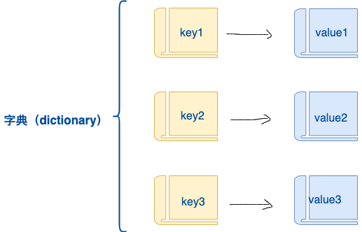

# Python Lesson07：列表，字典与字符串

## 列表

列表是最常用的 Python 数据类型，它可以作为一个方括号内的逗号分隔值出现。

列表的数据项不需要具有相同的类型。

创建一个列表，只要把逗号分隔的不同的数据项使用方括号括起来即可。如下所示：

```python
companies = ["百度", "谷歌", "微软", "脸书"]
```


列表中的元素可以使用索引数字来访问，也可以和while或者for循环结合使用：

```python
companies = ["百度", "谷歌", "微软", "脸书"]

print(companies[0])
print(companies[-1])

for company in companies:
    print(company)
```


运行结果为：

```python
百度
脸书
百度
谷歌
微软
脸书
```


或者我们可是使用切片：

```python
companies = ["百度", "谷歌", "微软", "脸书"]

print(companies[1:-1])
```


切片同样遵守左闭又开的原则。

列表包含了四个函数：

1. len()
2. max()
3. min()
4. list()

我们可以写一段这样的代码：

```python
numberList = [1,2,3,4,5,6,7,0]

print(len(numberList))
print(max(numberList))
print(min(numberList))
```


运行的结果为：

```python
8
7
0
```


Python包含以下方法:

|序号|方法|
|---|---|
|1|list.append(obj)在列表末尾添加新的对象|
|2|list.count(obj)统计某个元素在列表中出现的次数|
|3|list.extend(seq)在列表末尾一次性追加另一个序列中的多个值（用新列表扩展原来的列表）|
|4|list.index(obj)从列表中找出某个值第一个匹配项的索引位置|
|5|list.insert(index, obj)将对象插入列表|
|6|list.pop([index=-1])移除列表中的一个元素（默认最后一个元素），并且返回该元素的值|
|7|list.remove(obj)移除列表中某个值的第一个匹配项|
|8|list.reverse()反向列表中元素|
|9|list.sort( key=None, reverse=False)对原列表进行排序|
|10|list.clear()清空列表|
|11|list.copy()复制列表|


## 字典

字典是另一种可变容器模型，且可存储任意类型对象。

字典的每个键值 key=>value 对用冒号 : 分割，每个对之间用逗号(,)分割，整个字典包括在花括号 {} 中 ,格式如下所示：

```python
d = {key1 : value1, key2 : value2, key3 : value3 }
```


其结构如下所示：



键必须是唯一的，但值则不必。

值可以取任何数据类型，但键必须是不可变的，Number（数字）、String（字符串）、Tuple（元组）。

Python字典包含了以下内置函数：

|序号|函数及描述|实例|
|---|---|---|
|1|len(dict)计算字典元素个数，即键的总数。|>>> tinydict = {'Name': 'Runoob', 'Age': 7, 'Class': 'First'}|


> len(tinydict)


3 |
| 2 | str(dict)输出字典，可以打印的字符串表示。 | >>> tinydict = {'Name': 'Runoob', 'Age': 7, 'Class': 'First'}


> str(tinydict)


"{'Name': 'Runoob', 'Class': 'First', 'Age': 7}" |
| 3 | type(variable)返回输入的变量类型，如果变量是字典就返回字典类型。 | >>> tinydict = {'Name': 'Runoob', 'Age': 7, 'Class': 'First'}


> type(tinydict)


<class 'dict'> |

我们可以自己写一个程序来实现一下：

```python
companies = {"google":"Internet Company", "baidu":"Internet Company", "Aodi":"Car Company"}

print(len(companies))
print(str(companies))
print(type(companies))
```


运行的结果为：

```python
3
{'google': 'Internet Company', 'baidu': 'Internet Company', 'Aodi': 'Car Company'}
<class 'dict'>
```


