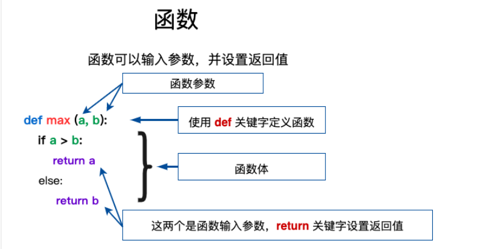

# Python Lesson08：函数

## 函数的结构

函数是组织好的，可重复使用的，用来实现单一，或相关联功能的代码段。

函数能提高应用的模块性，和代码的重复利用率。

以下是简单的规则：

- 函数代码块以 **def** 关键词开头，后接函数标识符名称和圆括号 **()**。
- 任何传入参数和自变量必须放在圆括号中间，圆括号之间可以用于定义参数。
- 函数的第一行语句可以选择性地使用文档字符串—用于存放函数说明。
- 函数内容以冒号 **:** 起始，并且缩进。
- return [表达式] 结束函数，选择性地返回一个值给调用方，不带表达式的 return 相当于返回 None。

函数组成的结构图如下所示：



我们可以写一个函数来计算圆的面积：

```python
def area(radius):
    return 3.14*radius*radius

r = 10
print("area = ", area(r))
```


运行的结果为：

```python
area =  314.0
```


## 可变更或者不可变更对象

**可更改(mutable)与不可更改(immutable)对象**

在 python 中，strings, tuples, 和 numbers 是不可更改的对象，而 list,dict 等则是可以修改的对象。

- **不可变类型：**变量赋值 **a=5** 后再赋值 **a=10**，这里实际是新生成一个 int 值对象 10，再让 a 指向它，而 5 被丢弃，不是改变 a 的值，相当于新生成了 a。
- **可变类型：**变量赋值 **la=[1,2,3,4]** 后再赋值 **la[2]=5** 则是将 list la 的第三个元素值更改，本身la没有动，只是其内部的一部分值被修改了。

python 函数的参数传递：

- **不可变类型：**类似 C++ 的值传递，如整数、字符串、元组。如 fun(a)，传递的只是 a 的值，没有影响 a 对象本身。如果在 fun(a) 内部修改 a 的值，则是新生成一个 a 的对象。
- **可变类型：**类似 C++ 的引用传递，如 列表，字典。如 fun(la)，则是将 la 真正的传过去，修改后 fun 外部的 la 也会受影响

python 中一切都是对象，严格意义我们不能说值传递还是引用传递，我们应该说传不可变对象和传可变对象。

## 四种类型的参数

必需参数须以正确的顺序传入函数。调用时的数量必须和声明时的一样。

调用 printme() 函数，你必须传入一个参数，不然会出现语法错误：

```python
#可写函数说明
def printme( str ):
   "打印任何传入的字符串"
   print (str)
   return
 
# 调用 printme 函数，不加参数会报错
printme()
```


运行结果为：

```python
Traceback (most recent call last):
  File "test.py", line 10, in <module>
    printme()
TypeError: printme() missing 1 required positional argument: 'str'
```


关键字参数和函数调用关系紧密，函数调用使用关键字参数来确定传入的参数值。

使用关键字参数允许函数调用时参数的顺序与声明时不一致，因为 Python 解释器能够用参数名匹配参数值。

以下实例在函数 printme() 调用时使用参数名：

```python
#可写函数说明
def printme( str ):
   "打印任何传入的字符串"
   print (str)
   return
 
#调用printme函数
printme( str = "教程")
```


运行结果为：

```python
教程
```


以下实例中演示了函数参数的使用不需要使用指定顺序：

```python
#可写函数说明
def printinfo( name, age ):
   "打印任何传入的字符串"
   print ("名字: ", name)
   print ("年龄: ", age)
   return
 
#调用printinfo函数
printinfo( age=50, name="张三" )
```


运行结果为：

```python
名字:  张三
年龄:  50
```


调用函数时，如果没有传递参数，则会使用默认参数。以下实例中如果没有传入 age 参数，则使用默认值：

```python
#可写函数说明
def printinfo( name, age = 35 ):
   "打印任何传入的字符串"
   print ("名字: ", name)
   print ("年龄: ", age)
   return
 
#调用printinfo函数
printinfo( age=50, name="张三" )
print ("------------------------")
printinfo( name="李四" )
```


运行结果为：

```python
名字:  张三
年龄:  50
------------------------
名字:  李四
年龄:  35
```


你可能需要一个函数能处理比当初声明时更多的参数。这些参数叫做不定长参数，和上述 2 种参数不同，声明时不会命名。基本语法如下：

```python
def functionname([formal_args,] *var_args_tuple ):
   "函数_文档字符串"
   function_suite
   return [expression]
```


加了星号 ***** 的参数会以元组(tuple)的形式导入，存放所有未命名的变量参数。

```python
# 可写函数说明
def printinfo( arg1, *vartuple ):
   "打印任何传入的参数"
   print ("输出: ")
   print (arg1)
   print (vartuple)
 
# 调用printinfo 函数
printinfo( 70, 60, 50 )
```


运行的结果为：

```python
输出: 
70
(60, 50)
```


如果在函数调用时没有指定参数，它就是一个空元组。我们也可以不向函数传递未命名的变量。如下实例：

```python
# 可写函数说明
def printinfo( arg1, *vartuple ):
   "打印任何传入的参数"
   print ("输出: ")
   print (arg1)
   for var in vartuple:
      print (var)
   return
 
# 调用printinfo 函数
printinfo( 10 )
printinfo( 70, 60, 50 )
```


运行结果为：

```python
输出: 
10
输出: 
70
60
50
```


加了两个星号 ****** 的参数会以字典的形式导入。

```python
# 可写函数说明
def printinfo( arg1, **vardict ):
   "打印任何传入的参数"
   print ("输出: ")
   print (arg1)
   print (vardict)
 
# 调用printinfo 函数
printinfo(1, a=2,b=3)
```


运行结果为：

```python
输出: 
1
{'a': 2, 'b': 3}
```


## 匿名函数

Python 使用 lambda 来创建匿名函数。

所谓匿名，意即不再使用 def 语句这样标准的形式定义一个函数。

- lambda 只是一个表达式，函数体比 def 简单很多。
- lambda 的主体是一个表达式，而不是一个代码块。仅仅能在 lambda 表达式中封装有限的逻辑进去。
- lambda 函数拥有自己的命名空间，且不能访问自己参数列表之外或全局命名空间里的参数。
- 虽然 lambda 函数看起来只能写一行，却不等同于 C 或 C++ 的内联函数，后者的目的是调用小函数时不占用栈内存从而增加运行效率。

lambda 函数的语法只包含一个语句，如下：

```python
lambda [arg1 [,arg2,.....argn]]:expression
```


以下实例匿名函数设置两个参数：

```python
def myfunc(n):
  return lambda a : a * n
 
mydoubler = myfunc(2)
mytripler = myfunc(3)
 
print(mydoubler(11))
print(mytripler(11))
```


运行的结果为：

```python
22
33
```


