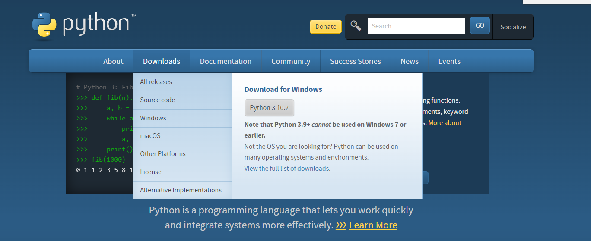
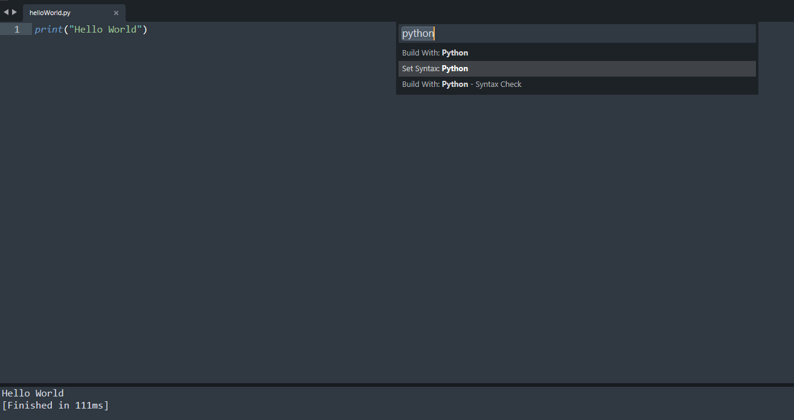

# Python11Lessons

# Python Lesson01：准备工作与工具

Python语言是一种广泛使用的解释型、高级和通用的编程语言。Python支持多种编程范型，包括函数式、指令式、反射式、结构化和面向对象编程。

Python拥有动态类型系统和垃圾回收功能，能够自动管理内存使用，并且其本身拥有一个巨大而广泛的标准库。它的语言结构以及面向对象的方法旨在帮助程序员为小型的和大型的项目编写清晰的、合乎逻辑的代码。

Python解释器本身几乎可以在所有的操作系统中运行。Python的官方解释器CPython是用C语言编写的，它是一个由社群驱动的自由软件，目前由Python软件基金会管理。

Python是解释性的语言：


Python语言的运行效率并不能够比得上C或者C++，但是使用Python语言进行开发的效率来的更高。

首先我们需要安装Python语言：


打开这个网站之后可以发现：



虽然Python 3.10.2是现阶段的最新的Python版本，但是这里并不推荐使用最新版本的Python语言，因为部分库能够并不支持最新版本的Python。

我们这是使用的是Python 3.7版本，这个是比较主流的版本，也适用于多数的使用或者支持Python的库或者软件：


需要注意的地方在于，当我们安装Python语言的时候，我们需要勾选add to PATH的选项：


这样一来Python语言便被加入到了开发环境当中。

当我们安装完成之后，我们可以打开cmd指令开测试是否成功的安装和将Python加载到PATH中：


如上图所示，我们成功的安装了Python语言，并且进入到了Python开发环境当中。

我们可以输入exit()来退出Python开发环境：


安装Python语言的时候，自带了一款Python语言的编译器：


但是这里并不推荐使用Python语言自带的编译器，而是使用第三方的编译器：Pycharm。


Pycharm有两个版本，这里推荐的是社区版本而不是专业版本：


社区版本是免费且开源的，对于新手而言已经足够使用了。

除了Pycharm之外，推荐使用的编辑器是sublime text：


如果你想要使用sublime text来运行Python代码，可以使用ctrl+shift+P然后选择Python语言，接着在完成Python代码之后使用Ctrl+B来运行Python代码。

如下图所示：



另外推荐使用的是jupyter notebook，这是一款轻量的编译器，通常在数据分析或者数据科学相关领域被使用到，如果有需求可以自行下载。

Python语言所持有的禅可以使用import this来进行调查：

```python
import this
```


输出的结果为：

```python
The Zen of Python, by Tim Peters

Beautiful is better than ugly.
Explicit is better than implicit.
Simple is better than complex.
Complex is better than complicated.
Flat is better than nested.
Sparse is better than dense.
Readability counts.
Special cases aren't special enough to break the rules.
Although practicality beats purity.
Errors should never pass silently.
Unless explicitly silenced.
In the face of ambiguity, refuse the temptation to guess.
There should be one-- and preferably only one --obvious way to do it.
Although that way may not be obvious at first unless you're Dutch.
Now is better than never.
Although never is often better than *right* now.
If the implementation is hard to explain, it's a bad idea.
If the implementation is easy to explain, it may be a good idea.
Namespaces are one honking great idea -- let's do more of those!
```

# Python Lesson02：打印与变量

## 打印

我们打开sublime text，将语言选择为Python语言，接着输入：

```python
print("Hello World")
```


按住ctrl+s进行保存，然后按住ctrl+B来进行运行：


运行的结果为Hello World。在这一段代码中print()是一个函数，用来将括号中的内容打印出来，而”Hello World“则表明了文本内容为Hello World。

接着我们使用一个变量来指代Hello World，并且将这个变量打印出来：

```python
sayHello = "Hello World"

print(sayHello)
```


运行的结果为：

```python
Hello World
```


在这一段代码中sayHello = "Hello World"表示我们将文本”Hello World“赋值到了sayHello这个变量中，之后当我们使用sayHello的时候，便会将其与Hello World这个文本相互关联。

print()函数不仅仅可以打印文本，也可以打印数字或者打印数字计算的结果：

```python
print(15)

print(10+15)

a = 15
b = 20

print(a+b)
```


运行的结果为：

```python
15
25
35
```


print()函数中的内容并不一定需要在同一行：

```python
print("Hello World "
  "GoodBye World")
```


运行的结果为：

```python
Hello World GoodBye World
```


## 变量

我们接着来了解一下什么是变量：变量来源于数学，是计算机语言中能储存计算结果或能表示值的抽象概念。

在我们上部分的代码中，无论是sayHello还是a或者b，实际上都是变量。


假设我们申明了一个变量并且对其进行赋值，那么该变量将会有该值的内存存储地址，当我们使用这个变量的时候，我们便会调用对应内存地址中的值。

比如说：

```python
a = 10
```


那么，计算机首先会在内存上开辟一个内存空间，接着将10这个值存储到这个内存空间中，接着申明一个变量a，并且让变量a存储该值的地址。

如果我们对a进行重新赋值：

```python
a = 10
a = 20
```


我们实际上是开辟了一个新的内存空间，并且向该内存空间存储20这个值，接着将新开辟的内存空间的内存地址赋值给a这个变量，如此a便指向了新的值。

Python语言允许进行同时赋值：

```python
a = b = c = 10
```


如此，a，b，c三个变量所对应的值都是10。

我们可以使用id()函数来查看一个变量的内存地址：

```python
a = b = c = 1

print(id(a))
print(id(b))
print(id(c))
```


运行的结果为：

```python
140723550059584
140723550059584
140723550059584
```


可以发现，实际上a,b,c三个变量都指向了同一个内存地址。

或者我们可以这么做：

```python
a, b = 1, 2

print(a)
print(b)

print(id(a))
print(id(b))
```


运行的结果为：

```python
1
2
140723819412544
140723819412576
```


可以发现，我们分别给a和b赋值了1和2。

在Python语言中，有6个标准的数据类型：

1. Number（数字）
2. String（字符串）
3. List（列表）
4. Tuple（元组）
5. Set（集合）
6. Dictionary（字典）

Python3 的六个标准数据类型中：

- 不可变数据（3 个）：Number（数字）、String（字符串）、Tuple（元组）；
- 可变数据（3 个）：List（列表）、Dictionary（字典）、Set（集合）。

如果我们不知道我们所使用的变量是什么类型的变量，我们可以使用type()函数来查看：

```python
numberOne = "123321"
numberTwo = 123321

print(type(numberOne))
print(type(numberTwo))
```


运行的结果为：

```python
<class 'str'>
<class 'int'>
```


Python语言中的命名规则为：

1. 标识符可以由字母、数字、下画线（_）组成，其中数字不能打头。
2. 标识符不能是 Python 关键字，但可以包含关键字。
3. 标识符不能包含空格。

如果你不知道Python的关键字是什么，可以使用：

```python
import keyword   # 导入了关键字模块

print(keyword.kwlist)   # 打印keyword的列表
```


运行的结果为：

```python
['False', 'None', 'True', 'and', 'as', 'assert', 'async', 'await', 'break', 'class', 'continue', 'def', 'del', 'elif', 'else', 'except', 'finally', 'for', 'from', 'global', 'if', 'import', 'in', 'is', 'lambda', 'nonlocal', 'not', 'or', 'pass', 'raise', 'return', 'try', 'while', 'with', 'yield']
```


Python 3是支持中文的，所以我们可以：

```python
打招呼 = "你好"

print(打招呼)
```


运行的结果为：

```python
你好
```


但是我们推荐使用英文作为变量名，而不是使用中文或者其他的什么语言。

# Python Lesson03：整型，浮点型和字符串类型

## 整型

整型(int) - 通常被称为是整型或整数，是正或负整数，不带小数点。Python3 整型是没有限制大的，可以当作 Long 类型使用，所以 Python3 没有 Python2 的 Long 类型。

如下所示为整型的常用用法：

```python
print(10)
print(10+10)

a = 10
print(a)
a = 20
print(a)

a = 10
b = 20
print(a,b)
print(a+b)
```


运行的结果为：

```python
10
20
10
20
10 20
30
```


实际上整数型没有什么特别需要讨论的。

需要注意的是，在Python语言中，整数的大小只取决于内存大小的限制，在内存大小充足的情况之下，整型的长度可以是无限的：

```python
a = 21321635465464544654654654613249683486431265413851321
b = 56464654346875968798797897943165413245643243212545456464646

print(a+b)
```


运行的结果为：

```python
56464675668511434263342552597820026495326729643810870315967
```


Python的int类型的数字可以比C或者C++中的long long要大很多。

## 浮点型

浮点型由整数部分与小数部分组成：

```python
a = 12.02

print(a)
```


运行的结果为：

```python
12.02
```


或者我们也可以使用科学计数法来进行表示：

```python
a = 2.5e2
b = 2.5e-3

print(a)
print(b)
```


运行的结果为：

```python
250.0
0.0025
```


## 数字类型之间的转换

我们可以使用int()和float()两个函数来对数字的类型进行转换：

```python
a = 10.00

print(a)
print(int(a))
print(type(int(a)))
```


运行的结果为：

```python
10.0
10
<class 'int'>
```


和：

```python
a = 10

print(a)
print(float(a))
print(type(float(a)))
```


运行的结果为：

```python
10
10.0
<class 'float'>
```


## 字符串类型

字符串是 Python 中最常用的数据类型。我们可以使用引号( **'** 或 **"** )来创建字符串：

```python
string_One = "string variable"
print(type(string_One))
print(string_One)
```


运行的结果为：

```python
<class 'str'>
string variable
```


我们可以通过索引位置来访问字符串的中的对应位置的字符：

```python
programming_Language = "Python"

print(programming_Language[0])
print(programming_Language[1])

print(programming_Language[-1])
print(programming_Language[-2])
```


运行的结果为：

```python
P
y
n
o
```


具体的逻辑如下所示：


需要注意的地方在于，在Python语言中，初始位置是0而不是1。

我们也可以使用切片的方式来访问一连串的位置的字符：

```python
programming_Language = "Python"

print(programming_Language[0:2])
```


运行的结果为：

```python
Py
```


课件我们打印了0,1两个位置的字符，也就是说切片遵循的是左闭右开的原则，即包含左边的位置但是不包含右边的位置的字符。

字符串常见的操作如下所示;

下表实例变量 a 值为字符串 "Hello"，b 变量值为 "Python"：

| 操作符         | 描述                                                         | 实例                         |
| -------------- | ------------------------------------------------------------ | ---------------------------- |
| +              | 字符串连接                                                   | a + b 输出结果： HelloPython |
| *              | 重复输出字符串                                               | a*2 输出结果：HelloHello     |
| []             | 通过索引获取字符串中字符                                     | a[1] 输出结果 e              |
| [ : ]          | 截取字符串中的一部分，遵循左闭右开原则，str[0:2] 是不包含第 3 个字符的。 | a[1:4] 输出结果 ell          |
| in             | 成员运算符 - 如果字符串中包含给定的字符返回 True             | 'H' in a 输出结果 True       |
| not in         | 成员运算符 - 如果字符串中不包含给定的字符返回 True           | 'M' not in a 输出结果 True   |
| r/R            | 原始字符串 - 原始字符串：所有的字符串都是直接按照字面的意思来使用，没有转义特殊或不能打印的字符。 原始字符串除在字符串的第一个引号前加上字母 r（可以大小写）以外，与普通字符串有着几乎完全相同的语法。 | print( r'\n' )               |
| print( R'\n' ) |                                                              |                              |


Python语言内置了许多与字符串相关的函数。

upper()函数可以将所有的小写字符转换为大写字符：

```python
programming_Language = "Python"

print(programming_Language.upper())
```


运行的结果为：

```python
PYTHON
```


同样的我们也可以将所有的字符从大写字符转换为小写字符，通过使用lower()函数：

```python
programming_Language = "PYTHON"

print(programming_Language.lower())
```


运行的结果为：

```python
python
```


亦或者我们可以将所有单词的首字母以大写的形式来进行显示：

```python
programming_Language = "python language"

print(programming_Language.title())
```


运行的结果为：

```python
Python Language
```


或者我们可以求取字符串的长度：

```python
programming_Language = "python language"

print(len(programming_Language))
```


运行的结果为：

```python
15
```


如果我们需要判断字符串是否只包含数字，则可以使用isdigit()函数：

```python
is_number = "123654"

print(is_number.isdigit())
```


运行的结果为：

```python
True
```


此外还有很多其他的内置的函数，可以在需要使用的时候再查询。

# Python Lesson04：运算符

## 算数运算符

Python的算数运算符如下所示：以下假设变量： a=10，b=20

| 运算符 | 描述                                            | 实例                                               |
| ------ | ----------------------------------------------- | -------------------------------------------------- |
| +      | 加 - 两个对象相加                               | a + b 输出结果 30                                  |
| -      | 减 - 得到负数或是一个数减去另一个数             | a - b 输出结果 -10                                 |
| *      | 乘 - 两个数相乘或是返回一个被重复若干次的字符串 | a * b 输出结果 200                                 |
| /      | 除 - x除以y                                     | b / a 输出结果 2                                   |
| %      | 取模 - 返回除法的余数                           | b % a 输出结果 0                                   |
| **     | 幂 - 返回x的y次幂                               | a**b 为10的20次方， 输出结果 100000000000000000000 |
| //     | 取整除 - 返回商的整数部分（向下取整）           | >>> 9//2                                           |
| 4      |                                                 |                                                    |


> -9//2


-5 |

我们可以对算数运算符进行实践：

```python
a = 10
b = 25

print(a+b)
print(a-b)
print(a*b)
print(a/b)
print(a**b)
print(a%b)
print(a//b)
```


运算的结果为：

```python
35
-15
250
0.4
10000000000000000000000000
10
0
```


## 比较运算符

以下假设变量： **a=10，b=20**：

| 运算符 | 描述                                                         | 实例                                     |
| ------ | ------------------------------------------------------------ | ---------------------------------------- |
| ==     | 等于 - 比较对象是否相等                                      | (a == b) 返回 False。                    |
| !=     | 不等于 - 比较两个对象是否不相等                              | (a != b) 返回 true.                      |
| <>     | 不等于 - 比较两个对象是否不相等。python3 已废弃。            | (a <> b) 返回 true。这个运算符类似 != 。 |
| >      | 大于 - 返回x是否大于y                                        | (a > b) 返回 False。                     |
| <      | 小于 - 返回x是否小于y。所有比较运算符返回1表示真，返回0表示假。这分别与特殊的变量True和False等价。 | (a < b) 返回 true。                      |
| >=     | 大于等于 - 返回x是否大于等于y。                              | (a >= b) 返回 False。                    |
| <=     | 小于等于 - 返回x是否小于等于y。                              | (a <= b) 返回 true。                     |


我们可以进行实践：

```python
a = 10
b = 20

print(a==b)
print(a!=b)
print(a>b)
print(a<b)
print(a>=b)
print(a<=b)
```


运行的结果为：

```python
False
True
False
True
False
True
```


## **Python逻辑运算符**

Python语言支持逻辑运算符，以下假设变量 a 为 10, b为 20:

| 运算符 | 逻辑表达式 | 描述                                                         | 实例                    |
| ------ | ---------- | ------------------------------------------------------------ | ----------------------- |
| and    | x and y    | 布尔"与" - 如果 x 为 False，x and y 返回 False，否则它返回 y 的计算值。 | (a and b) 返回 20。     |
| or     | x or y     | 布尔"或" - 如果 x 是非 0，它返回 x 的计算值，否则它返回 y 的计算值。 | (a or b) 返回 10。      |
| not    | not x      | 布尔"非" - 如果 x 为 True，返回 False 。如果 x 为 False，它返回 True。 | not(a and b) 返回 False |


我们可以先对and进行实践：

```python
a = 10
b = 20

print(a==a and b==a)   # a==a为true，则返回b==a的结果，结果为False
print(a==b and b==b)   # a==b为False，则返回False，这时候b==b为true，但是没有任何的影响
print(a==b and b==b)   # a==b为False，则直接返回False
print(a==a and b==b)   # a==a为True，这时候返回b==b的结果，所以结果为True
```


运行的结果为：

```python
False
False
False
True
```


同样的，我们也可以对or进行实践：

```python
a = 10
b = 20

# 0表示的是False
# 1表示的是True

print(a or b)   # a这个时候是非0，也就是非False，那么返回的是a的结果
print(0 or b)   # 这个时候是0，也就是False，那么返回的是b的结果
```


运行的结果为：

```python
10
20
```


接着是not：

```python
a = 10
b = 20

# 0表示的是False
# 1表示的是True

print(not a)
print(not b)
print(not 0)
```


运行的结果为：

```python
False
False
True
```


我们可以理解为以0为基准点，如果是0，则是False，如果不是0，则是被判定为True，而not则是结果取反，比如说not 0，就是 不是False，那么结果为True。

# Python Lesson05：条件运算符

Python语言的条件判断语句可以被如下所示的结构图所展示：


我们先来实现一个双项判断的if语句：

```python
grade = int(input("请输入学生的成绩："))

if grade>=60:
  print("成绩及格")
else:
  print("成绩不及格")
```


在这里，成绩以60作为了界限，如果大于60则属于及格，如果小于60则是不及格。

但是我们可以更加的细分：

```python
grade = int(input("请输入学生的成绩："))

if grade<60:
  print("不及格")
elif grade>=60 and grade<70:
  print("良好")
elif grade>=70 and grade<80:
  print("优秀")
else:
  print("突出")
```


我们可以将大于等于60的成绩进行细分。

或者我们来实现一下if的嵌套语句：

```python
proof = int(input("输入驾驶员每 100ml 血液酒精的含量："))
if proof < 20:
    print("驾驶员不构成酒驾")
else:
    if proof < 80:
        print("驾驶员已构成酒驾")
    else:
        print("驾驶员已构成醉驾")
```

# Python Lesson06：循环语句

## While循环

Python 编程中 while 语句用于循环执行程序，即在某条件下，循环执行某段程序，以处理需要重复处理的相同任务。


循环语句的结构如上所示。

我们可以来尝试一个简单的代码：

```python
count = 0
while (count < 9):
   print 'The count is:', count
   count = count + 1
 
print "Good bye!"
```


运行的结果为：

```python
The count is: 0
The count is: 1
The count is: 2
The count is: 3
The count is: 4
The count is: 5
The count is: 6
The count is: 7
The count is: 8
Good bye!
```


while循环还有两个非常重要的关键字：continue和break。

continue 用于跳过该次循环：

```python
i = 1
while i < 10:   
    i += 1
    if i%2 > 0:     # 非双数时跳过输出
        continue
    print(i)         # 输出双数2、4、6、8、10
```


运行的结果为：

```python
2
4
6
8
10
```


break 来跳过循环：

```python
i = 1
while 1:            # 循环条件为1必定成立
    print i         # 输出1~10
    i += 1
    if i > 10:     # 当i大于10时跳出循环
        break
```


运行的结果为：

```python
1
2
3
4
5
6
7
8
9
10
```


需要注意的是，1和true是等同的：

```python
if (1 == True):
  print("1 = True")
```


运行结果为：

```python
1 = True
```


所以上面的while循环其实判断的条件是恒定为True的，只是达成了某一个条件之后使用break来跳出了while循环。

基于这一点，其实我们可以实现让用户实现是否退出循环的功能：

```python
print("你可以输入任何一个数字，你输入的数字将会被打印出来")
print("如果你输入e（exit），程序则会结束")
print(" ")

while True:
  number = input(print("请输入你的数字："))

  if number != "e":
    print("你输入的数字是：", number)
  else:
    print("程序已经退出")
    break
```


如此，当用户的输入为e的时候，循环为True的条件就不成立了，这个时候while循环会break掉，程序也就运行结束了。

## for循环

for循环的语句如下所示：


我们可以用for循环来求取1~100的和：

```python
n = 100
 
sum = 0
counter = 1
while counter <= n:
    sum = sum + counter
    counter += 1
 
print("1 到 %d 之和为: %d" % (n,sum))
```


运行的结果为：

```python
5050
```


## pass语句

Python pass是空语句，是为了保持程序结构的完整性。

```python
word = "W111111W"

for w in word:
    if w == "1":
        pass    # pass只是用来占位让程序能够运行下去，但是什么都不会做
    else:
        print(w)
```


运行的结果为：

```python
W
W
```

# Python Lesson07：列表，字典与字符串

## 列表

列表是最常用的 Python 数据类型，它可以作为一个方括号内的逗号分隔值出现。

列表的数据项不需要具有相同的类型。

创建一个列表，只要把逗号分隔的不同的数据项使用方括号括起来即可。如下所示：

```python
companies = ["百度", "谷歌", "微软", "脸书"]
```


列表中的元素可以使用索引数字来访问，也可以和while或者for循环结合使用：

```python
companies = ["百度", "谷歌", "微软", "脸书"]

print(companies[0])
print(companies[-1])

for company in companies:
    print(company)
```


运行结果为：

```python
百度
脸书
百度
谷歌
微软
脸书
```


或者我们可是使用切片：

```python
companies = ["百度", "谷歌", "微软", "脸书"]

print(companies[1:-1])
```


切片同样遵守左闭又开的原则。

列表包含了四个函数：

1. len()
2. max()
3. min()
4. list()

我们可以写一段这样的代码：

```python
numberList = [1,2,3,4,5,6,7,0]

print(len(numberList))
print(max(numberList))
print(min(numberList))
```


运行的结果为：

```python
8
7
0
```


Python包含以下方法:

| 序号 | 方法                                                         |
| ---- | ------------------------------------------------------------ |
| 1    | list.append(obj)在列表末尾添加新的对象                       |
| 2    | list.count(obj)统计某个元素在列表中出现的次数                |
| 3    | list.extend(seq)在列表末尾一次性追加另一个序列中的多个值（用新列表扩展原来的列表） |
| 4    | list.index(obj)从列表中找出某个值第一个匹配项的索引位置      |
| 5    | list.insert(index, obj)将对象插入列表                        |
| 6    | list.pop([index=-1])移除列表中的一个元素（默认最后一个元素），并且返回该元素的值 |
| 7    | list.remove(obj)移除列表中某个值的第一个匹配项               |
| 8    | list.reverse()反向列表中元素                                 |
| 9    | list.sort( key=None, reverse=False)对原列表进行排序          |
| 10   | list.clear()清空列表                                         |
| 11   | list.copy()复制列表                                          |


## 字典

字典是另一种可变容器模型，且可存储任意类型对象。

字典的每个键值 key=>value 对用冒号 : 分割，每个对之间用逗号(,)分割，整个字典包括在花括号 {} 中 ,格式如下所示：

```python
d = {key1 : value1, key2 : value2, key3 : value3 }
```


其结构如下所示：


键必须是唯一的，但值则不必。

值可以取任何数据类型，但键必须是不可变的，Number（数字）、String（字符串）、Tuple（元组）。

Python字典包含了以下内置函数：

| 序号 | 函数及描述                              | 实例                                                         |
| ---- | --------------------------------------- | ------------------------------------------------------------ |
| 1    | len(dict)计算字典元素个数，即键的总数。 | >>> tinydict = {'Name': 'Runoob', 'Age': 7, 'Class': 'First'} |


> len(tinydict)


3 |
| 2 | str(dict)输出字典，可以打印的字符串表示。 | >>> tinydict = {'Name': 'Runoob', 'Age': 7, 'Class': 'First'}


> str(tinydict)


"{'Name': 'Runoob', 'Class': 'First', 'Age': 7}" |
| 3 | type(variable)返回输入的变量类型，如果变量是字典就返回字典类型。 | >>> tinydict = {'Name': 'Runoob', 'Age': 7, 'Class': 'First'}


> type(tinydict)


<class 'dict'> |

我们可以自己写一个程序来实现一下：

```python
companies = {"google":"Internet Company", "baidu":"Internet Company", "Aodi":"Car Company"}

print(len(companies))
print(str(companies))
print(type(companies))
```


运行的结果为：

```python
3
{'google': 'Internet Company', 'baidu': 'Internet Company', 'Aodi': 'Car Company'}
<class 'dict'>
```

# Python Lesson08：函数

## 函数的结构

函数是组织好的，可重复使用的，用来实现单一，或相关联功能的代码段。

函数能提高应用的模块性，和代码的重复利用率。

以下是简单的规则：

- 函数代码块以 **def** 关键词开头，后接函数标识符名称和圆括号 **()**。
- 任何传入参数和自变量必须放在圆括号中间，圆括号之间可以用于定义参数。
- 函数的第一行语句可以选择性地使用文档字符串—用于存放函数说明。
- 函数内容以冒号 **:** 起始，并且缩进。
- return [表达式] 结束函数，选择性地返回一个值给调用方，不带表达式的 return 相当于返回 None。

函数组成的结构图如下所示：


我们可以写一个函数来计算圆的面积：

```python
def area(radius):
    return 3.14*radius*radius

r = 10
print("area = ", area(r))
```


运行的结果为：

```python
area =  314.0
```


## 可变更或者不可变更对象

**可更改(mutable)与不可更改(immutable)对象**

在 python 中，strings, tuples, 和 numbers 是不可更改的对象，而 list,dict 等则是可以修改的对象。

- **不可变类型：**变量赋值 **a=5** 后再赋值 **a=10**，这里实际是新生成一个 int 值对象 10，再让 a 指向它，而 5 被丢弃，不是改变 a 的值，相当于新生成了 a。
- **可变类型：**变量赋值 **la=[1,2,3,4]** 后再赋值 **la[2]=5** 则是将 list la 的第三个元素值更改，本身la没有动，只是其内部的一部分值被修改了。

python 函数的参数传递：

- **不可变类型：**类似 C++ 的值传递，如整数、字符串、元组。如 fun(a)，传递的只是 a 的值，没有影响 a 对象本身。如果在 fun(a) 内部修改 a 的值，则是新生成一个 a 的对象。
- **可变类型：**类似 C++ 的引用传递，如 列表，字典。如 fun(la)，则是将 la 真正的传过去，修改后 fun 外部的 la 也会受影响

python 中一切都是对象，严格意义我们不能说值传递还是引用传递，我们应该说传不可变对象和传可变对象。

## 四种类型的参数

必需参数须以正确的顺序传入函数。调用时的数量必须和声明时的一样。

调用 printme() 函数，你必须传入一个参数，不然会出现语法错误：

```python
#可写函数说明
def printme( str ):
   "打印任何传入的字符串"
   print (str)
   return
 
# 调用 printme 函数，不加参数会报错
printme()
```


运行结果为：

```python
Traceback (most recent call last):
  File "test.py", line 10, in <module>
    printme()
TypeError: printme() missing 1 required positional argument: 'str'
```


关键字参数和函数调用关系紧密，函数调用使用关键字参数来确定传入的参数值。

使用关键字参数允许函数调用时参数的顺序与声明时不一致，因为 Python 解释器能够用参数名匹配参数值。

以下实例在函数 printme() 调用时使用参数名：

```python
#可写函数说明
def printme( str ):
   "打印任何传入的字符串"
   print (str)
   return
 
#调用printme函数
printme( str = "教程")
```


运行结果为：

```python
教程
```


以下实例中演示了函数参数的使用不需要使用指定顺序：

```python
#可写函数说明
def printinfo( name, age ):
   "打印任何传入的字符串"
   print ("名字: ", name)
   print ("年龄: ", age)
   return
 
#调用printinfo函数
printinfo( age=50, name="张三" )
```


运行结果为：

```python
名字:  张三
年龄:  50
```


调用函数时，如果没有传递参数，则会使用默认参数。以下实例中如果没有传入 age 参数，则使用默认值：

```python
#可写函数说明
def printinfo( name, age = 35 ):
   "打印任何传入的字符串"
   print ("名字: ", name)
   print ("年龄: ", age)
   return
 
#调用printinfo函数
printinfo( age=50, name="张三" )
print ("------------------------")
printinfo( name="李四" )
```


运行结果为：

```python
名字:  张三
年龄:  50
------------------------
名字:  李四
年龄:  35
```


你可能需要一个函数能处理比当初声明时更多的参数。这些参数叫做不定长参数，和上述 2 种参数不同，声明时不会命名。基本语法如下：

```python
def functionname([formal_args,] *var_args_tuple ):
   "函数_文档字符串"
   function_suite
   return [expression]
```


加了星号 ***** 的参数会以元组(tuple)的形式导入，存放所有未命名的变量参数。

```python
# 可写函数说明
def printinfo( arg1, *vartuple ):
   "打印任何传入的参数"
   print ("输出: ")
   print (arg1)
   print (vartuple)
 
# 调用printinfo 函数
printinfo( 70, 60, 50 )
```


运行的结果为：

```python
输出: 
70
(60, 50)
```


如果在函数调用时没有指定参数，它就是一个空元组。我们也可以不向函数传递未命名的变量。如下实例：

```python
# 可写函数说明
def printinfo( arg1, *vartuple ):
   "打印任何传入的参数"
   print ("输出: ")
   print (arg1)
   for var in vartuple:
      print (var)
   return
 
# 调用printinfo 函数
printinfo( 10 )
printinfo( 70, 60, 50 )
```


运行结果为：

```python
输出: 
10
输出: 
70
60
50
```


加了两个星号 ****** 的参数会以字典的形式导入。

```python
# 可写函数说明
def printinfo( arg1, **vardict ):
   "打印任何传入的参数"
   print ("输出: ")
   print (arg1)
   print (vardict)
 
# 调用printinfo 函数
printinfo(1, a=2,b=3)
```


运行结果为：

```python
输出: 
1
{'a': 2, 'b': 3}
```


## 匿名函数

Python 使用 lambda 来创建匿名函数。

所谓匿名，意即不再使用 def 语句这样标准的形式定义一个函数。

- lambda 只是一个表达式，函数体比 def 简单很多。
- lambda 的主体是一个表达式，而不是一个代码块。仅仅能在 lambda 表达式中封装有限的逻辑进去。
- lambda 函数拥有自己的命名空间，且不能访问自己参数列表之外或全局命名空间里的参数。
- 虽然 lambda 函数看起来只能写一行，却不等同于 C 或 C++ 的内联函数，后者的目的是调用小函数时不占用栈内存从而增加运行效率。

lambda 函数的语法只包含一个语句，如下：

```python
lambda [arg1 [,arg2,.....argn]]:expression
```


以下实例匿名函数设置两个参数：

```python
def myfunc(n):
  return lambda a : a * n
 
mydoubler = myfunc(2)
mytripler = myfunc(3)
 
print(mydoubler(11))
print(mytripler(11))
```


运行的结果为：

```python
22
33
```

# Python Lesson09：项目01~和平精英

## 游戏案例信息


## 以代码的方式来实现游戏案例

代码实现如下所示：

```React JSX
import random #导入需要使用的文件

print("------欢饮来打和平精英训练岛------")  # 先向玩家打招呼

solider_name = input(print("特种兵请留下名字吧： "))  # 要求输入名字

#我们在这里封装一个函数
def isHit(n, score):
  recod = 0
  for i in range(30):
    r1 = random.randint(1, n)
    r2 = random.randint(1, n)
    if r1 == r2:
      recod += score

  return recod

while True:

  choice = input(print("请输入： 1.室内靶场 2.大乱斗"))  # 要求用户选择模式
  

  # 判断用户输入的数字
  if choice == "1":
    print("请坐稳，传送点马上带你进入室内靶场")

    guns = ["AK47", "98K", "VSS", "AUG", "M726"]  # 用户需要选择使用的枪支
    for gun in guns:
      print(gun)
    gun = input(print("请选择枪支： "))

    levels = ["Easy", "Medium", "Difficult"]  # 用户需要选择游戏的难度
    for level in levels:
      print(level)
    level = input(print("请选择难度"))

    # 接着我们可以调用这个封装的函数
    # 注：Python会一行一行的来执行代码，所以被调用的函数需要在调用这个函数之前
    if level == "Easy":
      score = isHit(10, 5)
    elif level == "Normal":
      score = isHit(20, 10)
    elif level == "Difficult":
      score = isHit(30, 20)
    else:
      print("{}请选择正确的难度等级".format(solider_name))
      break

    print("训练完毕！{}使用{}抢在{}难度之下获得了{}的分数".format(solider_name, gun, level, score))
    break

  elif choice == "2":
    print("请做好准备，你马上就要变成一只可爱的光子鸡！")
    print("{}已经变成了一只小鸡仔，而且还有一把枪，射击模式开始！")
    coins = 0  # 用来表示金币
    level = 1  # 用来表示等级
    count = 0  # 击中敌人的个数

    while True:
      r = random.randint(1, 20)
      if r % 5 == 0:
        print("恭喜你击中了一个敌人")
        coins += r * level
        count += 1
      # 4种等级，0-400，400-900，900-2000，2000以上
      if coins >= 0 and coins < 400:
        level = 1
      elif coins >= 400 and coins < 900:
        level = 2
      elif coins >= 900 and coins < 2000:
        level = 3
      elif coins >= 2000:
        print("{}你已经是一个合格的特种兵了，请上战场吧！".format(solider_name))
        break
    break
  else:
    print("输入有误，请重新输入")
```

# Python Lesson10：面向对象编程

## 面向对象

面向对象技术如下所示：

1. 类(Class): 用来描述具有相同的属性和方法的对象的集合。它定义了该集合中每个对象所共有的属性和方法。对象是类的实例。
2. 方法：类中定义的函数。
3. 类变量：类变量在整个实例化的对象中是公用的。类变量定义在类中且在函数体之外。类变量通常不作为实例变量使用。
4. 数据成员：类变量或者实例变量用于处理类及其实例对象的相关的数据。
5. 方法重写：如果从父类继承的方法不能满足子类的需求，可以对其进行改写，这个过程叫方法的覆盖（override），也称为方法的重写。
6. 局部变量：定义在方法中的变量，只作用于当前实例的类。
7. 实例变量：在类的声明中，属性是用变量来表示的，这种变量就称为实例变量，实例变量就是一个用 self 修饰的变量。
8. 继承：即一个派生类（derived class）继承基类（base class）的字段和方法。继承也允许把一个派生类的对象作为一个基类对象对待。例如，有这样一个设计：一个Dog类型的对象派生自Animal类，这是模拟"是一个（is-a）"关系（例图，Dog是一个Animal）。
9. 实例化：创建一个类的实例，类的具体对象。
10. 对象：通过类定义的数据结构实例。对象包括两个数据成员（类变量和实例变量）和方法。

## 类

类对象支持两种操作：属性引用和实例化。

```python
class Car():
  """一个车的类"""

  # 首先设置了一个类变量，也就是轮胎的数量
  wheel_Number = 4

  def print_Wheel_Number(self):
    print("车子的轮胎数量是: 4")

# 我们通过Car()函数来将一个Car实例化
car_One = Car()

# 然后来访问这个类的属性和方法
print("轮胎的数量为：", car_One.wheel_Number)
car_One.print_Wheel_Number()
```


运行的结果为：

```python
轮胎的数量为： 4
车子的轮胎数量是: 4
```


类有一个名为 **init**() 的特殊方法（构造方法），该方法在类实例化时会自动调用，像下面这样：

```python
def __init__(self):
    self.data = []
```


我们将car class的代码进行稍微的改写：

```python
class Car():
  """一个车的类"""

  def __init__(self, light, wheel):
    self.l = light
    self.w = wheel

# 我们通过Car()函数来将一个Car实例化
car_One = Car(2, 4)

print("车子的车灯的数量为{},车子的轮子数量为{}".format(car_One.l, car_One.w))
```


在类的内部，使用 **def** 关键字来定义一个方法，与一般函数定义不同，类方法必须包含参数 self, 且为第一个参数，self 代表的是类的实例。

```python
class student():
  """一个学生类型"""

  def __init__(self, name, id, age):
    """名字，id和年龄"""
    self.name = name
    self.id = id
    self.age = age

  def printInformation(self):
    """用来打印学生的信息"""

    print("学生的名字为{}，学生的id为{}，学生的年龄为{}".format(self.name, self.id, self.age))

studentOne = student("John", "001", "16")

studentOne.printInformation()
```


再上述代码中，我们创建了一个student类型，并且给出了name，id和age三个属性，接着我们使用init来对其进行初始化，以及我们呢使用了printInformation函数来打印学生的信息。

接着我们用student类来生成了一个对象studeOne，并且通过init函数来给出了这个对象的具体的属性，然后我们调用了printInformation函数来将这个对象的属性打印出来。

## 单继承

Python 同样支持类的继承，如果一种语言不支持继承，类就没有什么意义。

我们可以之前的代码进行修改，来演示继承是如何运作的：

```python
class person():
  """人的类，每一个人都具有的最基础的属性"""

  # 先给出person类的基本属性
  # 如果一个属性是私有的，则可以使用 __来声明，比如 __name就是name属性是私有的
  name = ''
  age = ''

  def __init__(self, name, age):
    """"每个人都有姓名和年龄"""
    self.name = name
    self.age = age

  def printInformation(self):
    print("姓名为：{}".format(self.name))
    print("年龄为：{}".format(self.age))

class student(person):
  """学生类，继承person，但是具备了studentID这个属性"""
  
  # student 类的属性
  studentID = ''

  def __init__(self, name, age, studentID):
    
    # 调用父类的构造函数
    person.__init__(self, name, age)
    self.studentID = studentID

  # 对父类的函数进行覆写
  def printInformation(self):
    print("学生的姓名为：{}".format(self.name))
    print("学生的年龄为：{}".format(self.age))
    print("学生的ID为：{}".format(self.studentID))

# 然后我们来生成一个person和一个student进行尝试
person_One = person("John", "16")
person_One.printInformation()

print("   ")

student_One = student("Jobs", "18", "123")
student_One.printInformation()

print("   ")

# 接着让我们来对子类实例调用父类的被覆写的方法
super(student, student_One).printInformation()
```


运行的结果为：

```python
姓名为：John
年龄为：16
   
学生的姓名为：Jobs
学生的年龄为：18
学生的ID为：123
   
姓名为：Jobs
年龄为：18
```


在这个程序的最后一部分，我们使用了super函数来调用了父类中被子类覆写的方法：

```python
super(子类名, 子类生成的实列名).方法名称()
```


所以在这个时候我们输出的结果为：

```python
姓名为：Jobs
年龄为：18
```


因为父类person中的printInformation函数只输出了name和age两个属性。

# Python Lesson11：模块

模块是一个包含所有你定义的函数和变量的文件，其后缀名是.py。模块可以被别的程序引入，以使用该模块中的函数等功能。这也是使用 python 标准库的方法。

我们可以创建一个用来输出个人信息的模块，称之为叫做personalInformation.py：

```python
def printInformation(name, age):

  print("用户的名字为：{}".format(name))
  print("用户的年龄为：{}".format(age))

  print("欢饮你！")
```


接着我们再创建一个名为importTry.py的python文件：

```python
import personalInformation

personalInformation.printInformation("Jobs", "20")
```


运行的结果为：

```python
用户的名字为：Jobs
用户的年龄为：20
欢饮你！
```


可以发现我们在importTry.py文件中导入了personalInformation.py文件，并且被导入的文件中的功能可以被我们使用。

如此，我们可以尝试着将之前的类打包在一个文件当中，等我们需要的时候再使用这个文件：

```python
class person():
  """人的类，每一个人都具有的最基础的属性"""

  # 先给出person类的基本属性
  # 如果一个属性是私有的，则可以使用 __来声明，比如 __name就是name属性是私有的
  name = ''
  age = ''

  def __init__(self, name, age):
    """"每个人都有姓名和年龄"""
    self.name = name
    self.age = age

  def printInformation(self):
    print("姓名为：{}".format(self.name))
    print("年龄为：{}".format(self.age))

class student(person):
  """学生类，继承person，但是具备了studentID这个属性"""
  
  # student 类的属性
  studentID = ''

  def __init__(self, name, age, studentID):
    
    # 调用父类的构造函数
    person.__init__(self, name, age)
    self.studentID = studentID

  # 对父类的函数进行覆写
  def printInformation(self):
    print("学生的姓名为：{}".format(self.name))
    print("学生的年龄为：{}".format(self.age))
    print("学生的ID为：{}".format(self.studentID))
```


我们将person class和student class写在p_s.py文件中，接着我们在object01.py中调用这个模块：

```python
import p_s

# 然后我们来生成一个person和一个student进行尝试
person_One = p_s.person("John", "16")
person_One.printInformation()

print("   ")

student_One = p_s.student("Jobs", "18", "123")
student_One.printInformation()
```


运行的结果为：

```python
姓名为：John
年龄为：16
   
学生的姓名为：Jobs
学生的年龄为：18
学生的ID为：123
```


模块是一个非常有用的功能，我们可以将一些常用的代码写在模块里面，等需要的时候再进行调用。

Python 的 from 语句让你从模块中导入一个指定的部分到当前命名空间中，语法如下：

```python
from modname import name1[, name2[, ... nameN]]
```


